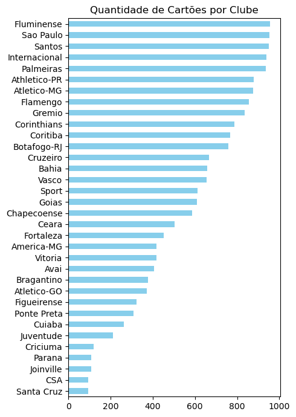

```python
import pandas as pd
import matplotlib.pyplot as plt
from tabulate import tabulate
```


```python
# Carregar dados do arquivo CSV para um DataFrame
df = pd.read_csv('campeonato-brasileiro-cartoes.csv')
```


```python
# Para visualizar as primeiras linhas do DataFrame
print(df.head())

```

       partida_id  rodata          clube   cartao                      atleta  \
    0        4607       1    Figueirense  Amarelo      Paulo Roberto da Silva   
    1        4607       1    Figueirense  Amarelo               Thiago Heleno   
    2        4608       1  Internacional  Amarelo         Andrés D'Alessandro   
    3        4608       1        Vitoria  Amarelo  Marcelo Machado dos Santos   
    4        4608       1        Vitoria  Amarelo                      Mansur   
    
       num_camisa     posicao minuto  
    0        28.0         NaN     66  
    1         4.0    Zagueiro     44  
    2        10.0  Meio-campo     72  
    3        29.0         NaN     86  
    4         NaN    Zagueiro     10  
    


```python
# Extrair os nomes dos atletas e a quantidade de cartões amarelos
nomes_atletas = df['atleta'].tolist()
quantidade_cartoes = df['cartao'].tolist()
```


```python
# Filtrar para mostrar apenas os cartões Amarelos
cartoes_amarelos = df.loc[df['cartao'] == 'Amarelo', 'cartao']
```


```python
# Contar o número de cartões amarelos por atleta
contagem_amarelos = df[df['cartao'] == 'Amarelo'].groupby('atleta').size().reset_index(name='QTD Amarelo')

# Encontrar o atleta com mais cartões amarelos
atleta_mais_amarelos = contagem_amarelos.loc[contagem_amarelos['QTD Amarelo'].idxmax()]

print(f"O atleta que recebeu mais cartões amarelos é '{atleta_mais_amarelos['atleta']}' com {atleta_mais_amarelos['QTD Amarelo']} cartões amarelos.")

```

    O atleta que recebeu mais cartões amarelos é 'Thiago Heleno' com 70 cartões amarelos.
    


```python
# Botar em ordem crescente
contagem_amarelos = contagem_amarelos.sort_values(by='QTD Amarelo', ascending=False)

# Selecionar os top 20 atletas com mais cartões amarelos
top_20 = contagem_amarelos.head(20)

print(top_20)
```

                                atleta  QTD Amarelo
    1876                 Thiago Heleno           70
    558                         Fagner           66
    1819                 Samuel Xavier           64
    1158      Lucas Rafael Araújo Lima           64
    1664      Reinaldo Manoel da Silva           62
    1982              Walter Kannemann           60
    191                 Bruno Henrique           60
    1994  Wellington Aparecido Martins           59
    619                           Fred           58
    1966                 Víctor Cuesta           57
    576                    Felipe Melo           57
    181   Bruno César Pereira da Silva           56
    955                     João Paulo           56
    936             José Rafael Vivian           52
    1510                  Nino Paraíba           50
    827                         Jadson           49
    2059                    Yago Rocha           49
    627                   Fábio Santos           47
    642         Gabriel Girotto Franco           47
    367                     David Braz           46
    


```python
# Criar uma coluna de ranking de 1 a 20
top_20['ranking'] = range(1, len(top_20) + 1)

# Exibir o resultado final com o ranking
print(top_20[['ranking', 'atleta', 'QTD Amarelo']])
```

          ranking                        atleta  QTD Amarelo
    1876        1                 Thiago Heleno           70
    558         2                        Fagner           66
    1819        3                 Samuel Xavier           64
    1158        4      Lucas Rafael Araújo Lima           64
    1664        5      Reinaldo Manoel da Silva           62
    1982        6              Walter Kannemann           60
    191         7                Bruno Henrique           60
    1994        8  Wellington Aparecido Martins           59
    619         9                          Fred           58
    1966       10                 Víctor Cuesta           57
    576        11                   Felipe Melo           57
    181        12  Bruno César Pereira da Silva           56
    955        13                    João Paulo           56
    936        14            José Rafael Vivian           52
    1510       15                  Nino Paraíba           50
    827        16                        Jadson           49
    2059       17                    Yago Rocha           49
    627        18                  Fábio Santos           47
    642        19        Gabriel Girotto Franco           47
    367        20                    David Braz           46
    

    C:\Users\Computador\AppData\Local\Temp\ipykernel_6820\1294239548.py:2: SettingWithCopyWarning: 
    A value is trying to be set on a copy of a slice from a DataFrame.
    Try using .loc[row_indexer,col_indexer] = value instead
    
    See the caveats in the documentation: https://pandas.pydata.org/pandas-docs/stable/user_guide/indexing.html#returning-a-view-versus-a-copy
      top_20['ranking'] = range(1, len(top_20) + 1)
    


```python
# Preparar os dados para a tabela
dados_tabela = top_20[['ranking', 'atleta', 'QTD Amarelo']].values.tolist()

# Criar a tabela formatada com tabulate
tabela_formatada1 = tabulate(dados_tabela, headers=['Ranking', 'Atleta', 'QTD Amarelo'], tablefmt='pretty')

# Exibir a tabela formatada
print(tabela_formatada1)
```

    +---------+------------------------------+-------------+
    | Ranking |            Atleta            | QTD Amarelo |
    +---------+------------------------------+-------------+
    |    1    |        Thiago Heleno         |     70      |
    |    2    |            Fagner            |     66      |
    |    3    |        Samuel Xavier         |     64      |
    |    4    |   Lucas Rafael Araújo Lima   |     64      |
    |    5    |   Reinaldo Manoel da Silva   |     62      |
    |    6    |       Walter Kannemann       |     60      |
    |    7    |        Bruno Henrique        |     60      |
    |    8    | Wellington Aparecido Martins |     59      |
    |    9    |             Fred             |     58      |
    |   10    |        Víctor Cuesta         |     57      |
    |   11    |         Felipe Melo          |     57      |
    |   12    | Bruno César Pereira da Silva |     56      |
    |   13    |          João Paulo          |     56      |
    |   14    |      José Rafael Vivian      |     52      |
    |   15    |         Nino Paraíba         |     50      |
    |   16    |            Jadson            |     49      |
    |   17    |          Yago Rocha          |     49      |
    |   18    |         Fábio Santos         |     47      |
    |   19    |    Gabriel Girotto Franco    |     47      |
    |   20    |          David Braz          |     46      |
    +---------+------------------------------+-------------+
    


```python
# Filtrar para mostrar apenas os cartões Vermelhos
cartoes_vermelhos = df.loc[df['cartao'] == 'Vermelho', 'cartao']
```


```python
# Contar o número de cartões amarelos por atleta
contagem_vermelhos = df[df['cartao'] == 'Vermelho'].groupby('atleta').size().reset_index(name='QTD Vermelho')

# Encontrar o atleta com mais cartões amarelos
atleta_mais_vermelhos = contagem_vermelhos.loc[contagem_vermelhos['QTD Vermelho'].idxmax()]

print(f"O atleta que recebeu mais cartões amarelos é '{atleta_mais_vermelhos['atleta']}' com {atleta_mais_vermelhos['QTD Vermelho']} cartões vermelhos.")

```

    O atleta que recebeu mais cartões amarelos é 'David Braz' com 7 cartões vermelhos.
    


```python
# Botar em ordem crescente
contagem_vermelhos = contagem_vermelhos.sort_values(by='QTD Vermelho', ascending=False)

# Selecionar os top 20 atletas com mais cartões vermelhos
top_20 = contagem_vermelhos.head(20)

print(top_20)
```

                                   atleta  QTD Vermelho
    104                        David Braz             7
    188                   Gabriel Barbosa             6
    560                     Thiago Heleno             6
    142          Edílson Mendes Guimarães             5
    287                José Rafael Vivian             5
    550                     Samuel Xavier             5
    322           Leonardo Moreira Morais             5
    546        Rossicley Pereira da Silva             5
    119                       Diego Souza             5
    224           Gustavo Henrique Vernes             5
    528         Rodrigo Baldasso da Costa             4
    593                  Walter Kannemann             4
    352                Lucas Rios Marques             4
    355                   Lucas Veríssimo             4
    365   Luiz Fernando Moraes dos Santos             4
    506          Reinaldo Manoel da Silva             4
    294             João Vitor Lima Gomes             4
    382     Manoel Messias Silva Carvalho             4
    81   Clayson Henrique da Silva Vieira             4
    258                            Jadson             4
    


```python
# Criar uma coluna de ranking de 1 a 20
top_20['ranking'] = range(1, len(top_20) + 1)

# Exibir o resultado final com o ranking
print(top_20[['ranking', 'atleta', 'QTD Vermelho']])
```

         ranking                            atleta  QTD Vermelho
    104        1                        David Braz             7
    188        2                   Gabriel Barbosa             6
    560        3                     Thiago Heleno             6
    142        4          Edílson Mendes Guimarães             5
    287        5                José Rafael Vivian             5
    550        6                     Samuel Xavier             5
    322        7           Leonardo Moreira Morais             5
    546        8        Rossicley Pereira da Silva             5
    119        9                       Diego Souza             5
    224       10           Gustavo Henrique Vernes             5
    528       11         Rodrigo Baldasso da Costa             4
    593       12                  Walter Kannemann             4
    352       13                Lucas Rios Marques             4
    355       14                   Lucas Veríssimo             4
    365       15   Luiz Fernando Moraes dos Santos             4
    506       16          Reinaldo Manoel da Silva             4
    294       17             João Vitor Lima Gomes             4
    382       18     Manoel Messias Silva Carvalho             4
    81        19  Clayson Henrique da Silva Vieira             4
    258       20                            Jadson             4
    

    C:\Users\Computador\AppData\Local\Temp\ipykernel_6820\1228907968.py:2: SettingWithCopyWarning: 
    A value is trying to be set on a copy of a slice from a DataFrame.
    Try using .loc[row_indexer,col_indexer] = value instead
    
    See the caveats in the documentation: https://pandas.pydata.org/pandas-docs/stable/user_guide/indexing.html#returning-a-view-versus-a-copy
      top_20['ranking'] = range(1, len(top_20) + 1)
    


```python
# Preparar os dados para a tabela
dados_tabela = top_20[['ranking', 'atleta', 'QTD Vermelho']].values.tolist()

# Criar a tabela formatada com tabulate
tabela_formatada2 = tabulate(dados_tabela, headers=['Ranking', 'Atleta', 'QTD Vermelho'], tablefmt='pretty')

# Exibir a tabela formatada
print(tabela_formatada2)
```

    +---------+----------------------------------+--------------+
    | Ranking |              Atleta              | QTD Vermelho |
    +---------+----------------------------------+--------------+
    |    1    |            David Braz            |      7       |
    |    2    |         Gabriel Barbosa          |      6       |
    |    3    |          Thiago Heleno           |      6       |
    |    4    |     Edílson Mendes Guimarães     |      5       |
    |    5    |        José Rafael Vivian        |      5       |
    |    6    |          Samuel Xavier           |      5       |
    |    7    |     Leonardo Moreira Morais      |      5       |
    |    8    |    Rossicley Pereira da Silva    |      5       |
    |    9    |           Diego Souza            |      5       |
    |   10    |     Gustavo Henrique Vernes      |      5       |
    |   11    |    Rodrigo Baldasso da Costa     |      4       |
    |   12    |         Walter Kannemann         |      4       |
    |   13    |        Lucas Rios Marques        |      4       |
    |   14    |         Lucas Veríssimo          |      4       |
    |   15    | Luiz Fernando Moraes dos Santos  |      4       |
    |   16    |     Reinaldo Manoel da Silva     |      4       |
    |   17    |      João Vitor Lima Gomes       |      4       |
    |   18    |  Manoel Messias Silva Carvalho   |      4       |
    |   19    | Clayson Henrique da Silva Vieira |      4       |
    |   20    |              Jadson              |      4       |
    +---------+----------------------------------+--------------+
    


```python
# Separar as linhas de cada tabela
linhas_tabela1 = tabela_formatada1.strip().splitlines()
linhas_tabela2 = tabela_formatada2.strip().splitlines()

# Imprimir as tabelas lado a lado
for linha1, linha2 in zip(linhas_tabela1, linhas_tabela2):
    print(linha1 + '    ' + linha2)
```

    +---------+------------------------------+-------------+    +---------+----------------------------------+--------------+
    | Ranking |            Atleta            | QTD Amarelo |    | Ranking |              Atleta              | QTD Vermelho |
    +---------+------------------------------+-------------+    +---------+----------------------------------+--------------+
    |    1    |        Thiago Heleno         |     70      |    |    1    |            David Braz            |      7       |
    |    2    |            Fagner            |     66      |    |    2    |         Gabriel Barbosa          |      6       |
    |    3    |        Samuel Xavier         |     64      |    |    3    |          Thiago Heleno           |      6       |
    |    4    |   Lucas Rafael Araújo Lima   |     64      |    |    4    |     Edílson Mendes Guimarães     |      5       |
    |    5    |   Reinaldo Manoel da Silva   |     62      |    |    5    |        José Rafael Vivian        |      5       |
    |    6    |       Walter Kannemann       |     60      |    |    6    |          Samuel Xavier           |      5       |
    |    7    |        Bruno Henrique        |     60      |    |    7    |     Leonardo Moreira Morais      |      5       |
    |    8    | Wellington Aparecido Martins |     59      |    |    8    |    Rossicley Pereira da Silva    |      5       |
    |    9    |             Fred             |     58      |    |    9    |           Diego Souza            |      5       |
    |   10    |        Víctor Cuesta         |     57      |    |   10    |     Gustavo Henrique Vernes      |      5       |
    |   11    |         Felipe Melo          |     57      |    |   11    |    Rodrigo Baldasso da Costa     |      4       |
    |   12    | Bruno César Pereira da Silva |     56      |    |   12    |         Walter Kannemann         |      4       |
    |   13    |          João Paulo          |     56      |    |   13    |        Lucas Rios Marques        |      4       |
    |   14    |      José Rafael Vivian      |     52      |    |   14    |         Lucas Veríssimo          |      4       |
    |   15    |         Nino Paraíba         |     50      |    |   15    | Luiz Fernando Moraes dos Santos  |      4       |
    |   16    |            Jadson            |     49      |    |   16    |     Reinaldo Manoel da Silva     |      4       |
    |   17    |          Yago Rocha          |     49      |    |   17    |      João Vitor Lima Gomes       |      4       |
    |   18    |         Fábio Santos         |     47      |    |   18    |  Manoel Messias Silva Carvalho   |      4       |
    |   19    |    Gabriel Girotto Franco    |     47      |    |   19    | Clayson Henrique da Silva Vieira |      4       |
    |   20    |          David Braz          |     46      |    |   20    |              Jadson              |      4       |
    +---------+------------------------------+-------------+    +---------+----------------------------------+--------------+
    


```python
# Agrupar por clube e contar o número de cartões amarelos
CartoesPorClube = df.groupby('clube')['cartao'].count()

# Ordenar do maior para o menor
CartoesPorClube = CartoesPorClube.sort_values(ascending=True)

# Exibir o resultado
print(CartoesPorClube)
```

    clube
    Santa Cruz        95
    CSA               95
    Joinville        107
    Parana           109
    Criciuma         121
    Juventude        210
    Cuiaba           264
    Ponte Preta      308
    Figueirense      324
    Atletico-GO      373
    Bragantino       378
    Avai             406
    Vitoria          417
    America-MG       418
    Fortaleza        452
    Ceara            504
    Chapecoense      587
    Goias            609
    Sport            611
    Vasco            654
    Bahia            658
    Cruzeiro         666
    Botafogo-RJ      758
    Coritiba         766
    Corinthians      788
    Gremio           835
    Flamengo         855
    Atletico-MG      877
    Athletico-PR     878
    Palmeiras        937
    Internacional    938
    Santos           950
    Sao Paulo        953
    Fluminense       956
    Name: cartao, dtype: int64
    


```python
# Criar o gráfico de barras horizontais (barras laterais)
plt.figure(figsize=(5, 7))  # Ajustar o tamanho da figura (opcional)
CartoesPorClube.plot(kind='barh', color='skyblue')  # Plotar o gráfico de barras horizontais
    
# Personalizar o gráfico
plt.title('Quantidade de Cartões por Clube')
plt.xlabel('')
plt.ylabel('')
plt.tight_layout()  # Ajustar o layout para evitar cortar o título
    
# Mostrar o gráfico
plt.show()
```


    

    

